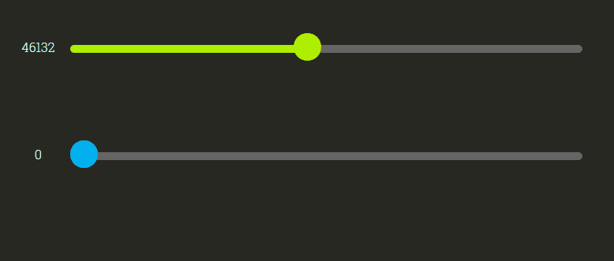

# Scrubbing-Speed-JS

ScrubbingSpeed.js is a variable scrubbing speed slider solution for web developers. It has no dependencies.

You can view an interactive sample and accompanying article at http://derekknox.com/articles/scrubbing-speed-js/#example-scrubbing-speed-js.



##Code Example
```html
<div class="scrubbing-speed-wrapper ss-spacer">
    <div class="scrubbing-speed-slider"
        data-ss-name="my-slider"
        data-ss-min="0"
        data-ss-max="100000"
        data-ss-color-fill="#AEEE00"
        data-ss-color-empty="#666"></div>
</div>
```
```javascript
ScrubbingSpeed.init('my-slider', function(args){ 
	console.log(args.min);			//maps to data-ss-min set in DOM
	console.log(args.current);		//maps to current value between min and max
	console.log(args.max);			//maps to data-ss-max set in DOM
	console.log(args.speed);		//returns the speed
	console.log(args.percentX);		//returns percentX of knob within track
	console.log(args.percentY);		//returns percentY from origPos.y click/touch
});
```

##License
	
	The MIT License (MIT)

	Copyright (c) 2015 Derek Knox | Braindrop Labs

	Permission is hereby granted, free of charge, to any person obtaining a copy
	of this software and associated documentation files (the "Software"), to deal
	in the Software without restriction, including without limitation the rights
	to use, copy, modify, merge, publish, distribute, sublicense, and/or sell
	copies of the Software, and to permit persons to whom the Software is
	furnished to do so, subject to the following conditions:

	The above copyright notice and this permission notice shall be included in all
	copies or substantial portions of the Software.

	THE SOFTWARE IS PROVIDED "AS IS", WITHOUT WARRANTY OF ANY KIND, EXPRESS OR
	IMPLIED, INCLUDING BUT NOT LIMITED TO THE WARRANTIES OF MERCHANTABILITY,
	FITNESS FOR A PARTICULAR PURPOSE AND NONINFRINGEMENT. IN NO EVENT SHALL THE
	AUTHORS OR COPYRIGHT HOLDERS BE LIABLE FOR ANY CLAIM, DAMAGES OR OTHER
	LIABILITY, WHETHER IN AN ACTION OF CONTRACT, TORT OR OTHERWISE, ARISING FROM,
	OUT OF OR IN CONNECTION WITH THE SOFTWARE OR THE USE OR OTHER DEALINGS IN THE
	SOFTWARE.

##Designed and Developed By
Derek Knox | Braindrop Labs